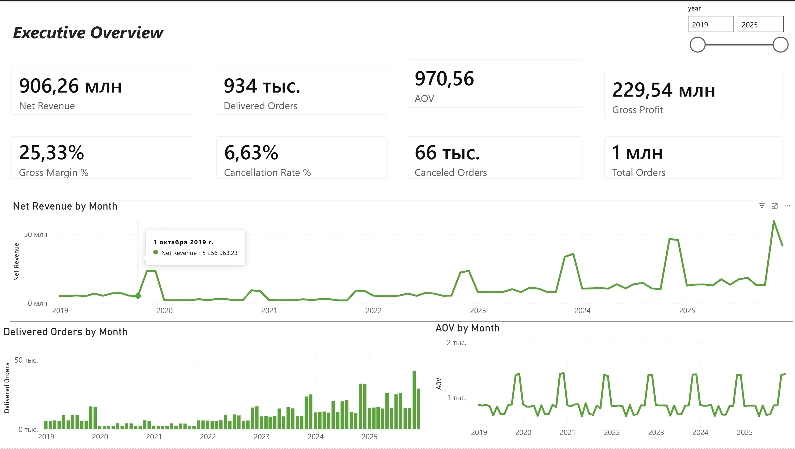
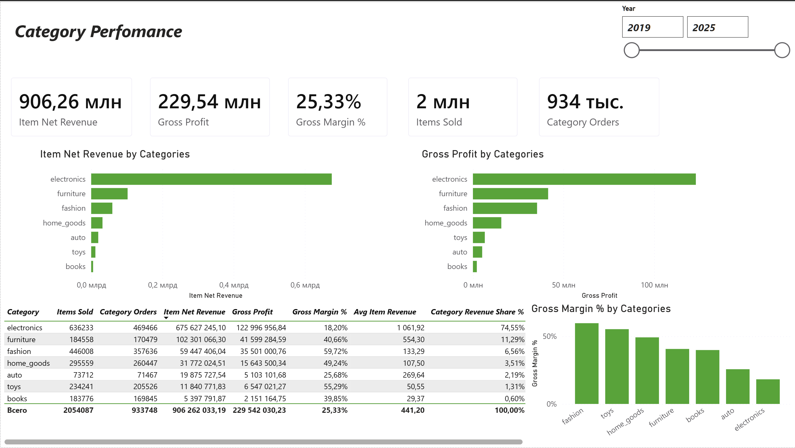
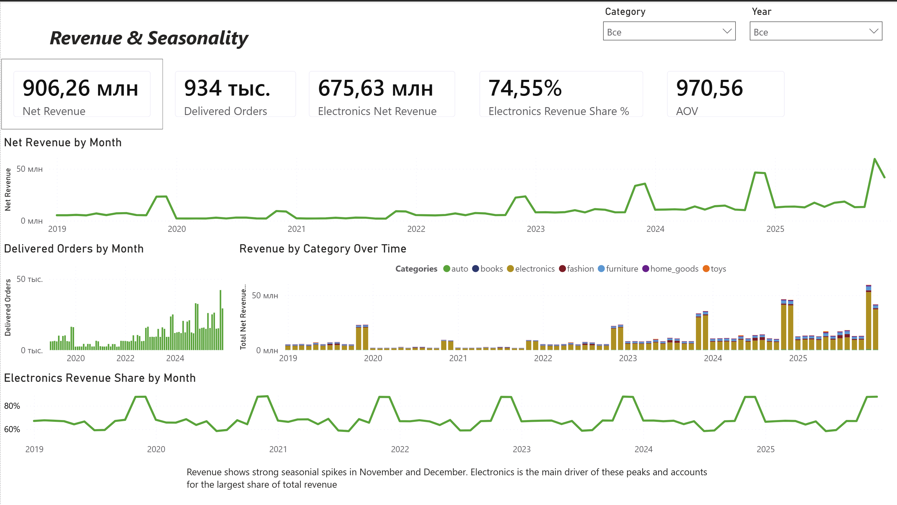
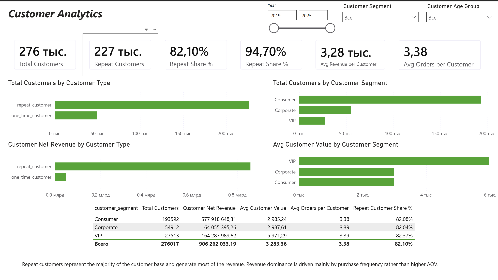
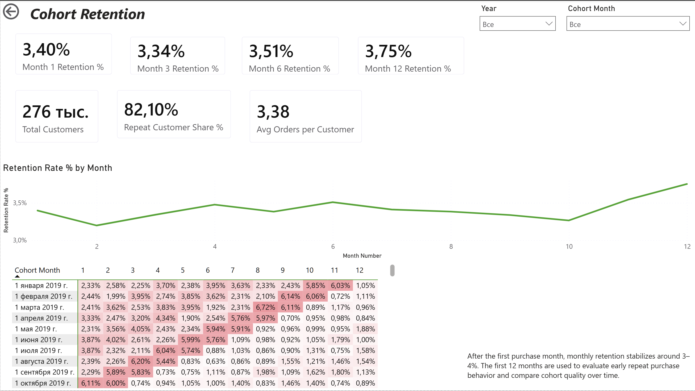

[English README](README.md)
# U.S. E-Commerce Analytics Mart

## Описание проекта

Это end-to-end аналитический проект по данным e-commerce в США. В проекте используется датасет с заказами, клиентами, товарами, продавцами, платежами, отзывами и геоданными.

Цель проекта - построить аналитический слой в PostgreSQL, рассчитать ключевые бизнес-метрики и создать интерактивный Power BI дашборд для анализа выручки, прибыльности, категорий, поведения клиентов и удержания.

Проект построен по слоистой аналитической архитектуре:

```text
raw -> stg -> mart -> metrics -> Power BI
```

## Бизнес-вопросы

Проект отвечает на следующие вопросы:

1. Какова общая бизнес-динамика по выручке, заказам, AOV и маржинальности?
2. Какие категории товаров приносят больше всего выручки и gross profit?
3. Есть ли сезонные всплески выручки по месяцам и годам?
4. Какие категории являются драйверами сезонных пиков?
5. Насколько важны repeat customers для общей выручки?
6. Как ведёт себя retention клиентов после месяца первой покупки?

## Стек технологий

* PostgreSQL
* DBeaver
* SQL
* Power BI
* Data modeling
* Data quality checks
* Product analytics
* Customer analytics
* Cohort retention analysis
* Revenue and profitability analysis

## Структура данных

В проекте используются следующие исходные таблицы:

* `customers`
* `orders`
* `order_items`
* `order_payments`
* `order_reviews`
* `products`
* `sellers`
* `geolocation`

## Архитектура данных

Проект состоит из трёх основных SQL-слоёв.

### Raw layer

Схема `raw` содержит исходные CSV-данные без бизнес-трансформаций.

Пример таблиц:

* `raw.customers`
* `raw.orders`
* `raw.order_items`
* `raw.order_payments`
* `raw.order_reviews`
* `raw.products`
* `raw.sellers`
* `raw.geolocation`

### Staging layer

Схема `stg` содержит очищенные и подготовленные представления для дальнейшей аналитики.

Основные staging views:

* `stg.stg_orders`
* `stg.stg_customers`
* `stg.stg_order_items`
* `stg.stg_order_payments`
* `stg.stg_order_reviews`
* `stg.stg_products`
* `stg.stg_sellers`
* `stg.stg_geolocation`

На этом слое создаются подготовленные поля:

* `purchase_date`
* `purchase_month`
* `is_delivered`
* `is_canceled`
* `discount_amount`
* `net_item_revenue`
* `gross_profit`
* возрастные группы клиентов и продавцов
* агрегированные платежи на уровне заказа
* агрегированная геолокация на уровне zip-кода

### Mart layer

Схема `mart` содержит аналитические витрины для расчёта метрик и подключения в Power BI.

Основные витрины:

* `mart.fct_orders`
* `mart.fct_order_items`
* `mart.fct_customer_value`
* `mart.fct_cohort_retention`
* `mart.dim_date`

## Ключевые правила grain

В проекте отдельно контролируется grain таблиц, чтобы избежать неправильных JOIN-ов и завышения метрик.

| Таблица                     | Grain                                      | Назначение                                           |
| --------------------------- | ------------------------------------------ | ---------------------------------------------------- |
| `mart.fct_orders`           | 1 строка = 1 заказ                         | Заказы, выручка, AOV, отмены, customer-level метрики |
| `mart.fct_order_items`      | 1 строка = 1 товарная позиция              | Категории, товары, продавцы, gross profit, margin    |
| `mart.fct_customer_value`   | 1 строка = 1 клиент                        | Customer value, repeat customers, сегменты           |
| `mart.fct_cohort_retention` | 1 строка = 1 cohort month + 1 month number | Cohort retention                                     |
| `mart.dim_date`             | 1 строка = 1 календарная дата              | Фильтрация по датам в Power BI                       |

## Важные ограничения JOIN-ов

Некоторые таблицы нельзя напрямую объединять без предварительной агрегации:

```text
orders + raw.order_items + raw.order_payments
customers + raw.geolocation
```

Причина — разный уровень детализации данных.

Примеры:

* `order_items` имеет grain 1 строка = 1 товарная позиция.
* `order_payments` может иметь несколько платежных строк на один заказ.
* `geolocation` содержит несколько строк на один zip-код.

Поэтому перед построением order-level витрины:

* `order_items` агрегируются до `order_id`;
* `order_payments` агрегируются до `order_id`;
* `geolocation` агрегируется до `zip_code_prefix`.

## Основные метрики

В проекте рассчитываются следующие метрики:

* Total Orders
* Delivered Orders
* Canceled Orders
* Cancellation Rate %
* Net Revenue
* Gross Item Revenue
* Total Discount Amount
* AOV
* Gross Profit
* Gross Margin %
* Items Sold
* Category Orders
* Category Revenue Share %
* Total Customers
* Repeat Customers
* Repeat Customer Share %
* Repeat Revenue Share %
* Avg Revenue per Customer
* Avg Orders per Customer
* Monthly Cohort Retention

Подробные определения метрик находятся в файле:

```text
docs/metric_definitions.md
```

## Бизнес-правила расчёта

### Revenue

Выручка считается только по доставленным заказам:

```sql
is_delivered = 1
```

Отменённые заказы не входят в sales/revenue метрики, но используются для расчёта cancellation rate.

### Customer analytics

Для анализа клиентов используется поле:

```text
customer_unique_id
```

`customer_id` используется для связи заказа с клиентской записью, но для repeat purchase, customer value и retention нужен именно `customer_unique_id`.

### Retention

Для cohort retention используется логика:

```text
1 строка = 1 customer_unique_id + 1 active month
```

Если клиент сделал несколько заказов в одном месяце, для retention он считается как один активный клиент в этом месяце.

## Power BI Dashboard

Power BI дашборд состоит из пяти страниц.

### 1. Executive Overview

Страница даёт общий обзор бизнеса:

* Net Revenue
* Delivered Orders
* AOV
* Gross Profit
* Gross Margin %
* Cancellation Rate %
* динамика выручки и заказов по месяцам



### 2. Category Performance

Страница анализирует категории по выручке, прибыли и маржинальности.

Основной вывод:

`electronics` является главным драйвером выручки и gross profit. При этом категории `fashion`, `toys` и `home_goods` показывают более высокую маржинальность.



### 3. Revenue & Seasonality

Страница показывает сезонность выручки и вклад категорий во временной динамике.

Основной вывод:

В ноябре и декабре наблюдаются сильные всплески выручки. Основной драйвер этих пиков — категория `electronics`.



### 4. Customer Analytics

Страница анализирует ценность клиентов, repeat customers и клиентские сегменты.

Основной вывод:

Repeat customers составляют большую часть клиентской базы и генерируют почти всю выручку. Доминирование repeat customers по выручке связано в первую очередь с частотой покупок, а не с более высоким средним чеком.



### 5. Cohort Retention

Страница показывает retention клиентов после месяца первой покупки.

Основной вывод:

После месяца первой покупки monthly retention стабилизируется примерно на уровне 3–4%. Первые 12 месяцев используются для оценки раннего повторного поведения клиентов и сравнения качества когорт.



## Основные результаты

### 1. Заказы и выручка

В датасете содержится:

* 1,000,000 заказов всего;
* 933,748 доставленных заказов;
* 66,252 отменённых заказа.

Net Revenue по доставленным заказам составляет примерно:

```text
906.26 млн
```

AOV составляет:

```text
970.56
```

### 2. Прибыльность

Общий Gross Profit составляет примерно:

```text
229.54 млн
```

Общая Gross Margin:

```text
25.33%
```

### 3. Категории

`electronics`(Электроника) — ключевая категория по выручке и gross profit.

При этом категория не является самой маржинальной. Более высокую gross margin показывают:

* `fashion`
* `toys`
* `home_goods`

Это значит, что `electronics` важна как основной источник оборота, а более маржинальные категории могут быть стратегически важны для роста прибыльности.

### 4. Сезонность

Выручка имеет выраженные сезонные пики в ноябре и декабре.

Анализ категорий показывает, что значительная часть сезонного роста связана с электроникой.

### 5. Клиенты

Repeat customers составляют:

```text
82.10%
```

от клиентской базы и генерируют:

```text
94.70%
```

выручки.

Это показывает, что повторные клиенты являются ключевым источником выручки. Их вклад связан в первую очередь с большей частотой покупок.

### 6. Retention

Monthly retention после первой покупки находится примерно на уровне 3–4% в первые 12 месяцев.

При этом высокий repeat customer share показывает, что клиенты возвращаются распределённо по разным месяцам, а не обязательно строго в следующий месяц после первой покупки.

## Структура репозитория

```text
us-ecommerce-analytics-mart/
│
├── README.md
├── README_RU.md
├── .gitignore
│
├── sql/
│   ├── 01_create_raw_tables.sql
│   ├── 02_create_raw_indexes.sql
│   ├── 03_data_quality_checks.sql
│   ├── 04_staging_views.sql
│   ├── 05_marts.sql
│   └── 06_metrics_queries.sql
│
├── docs/
│   ├── metric_definitions.md
│   └── data_model.md
│
├── powerbi/
│   └── us_ecommerce_analytics_dashboard.pbix
│
└── screenshots/
    ├── 01_executive_overview.png
    ├── 02_category_performance.png
    ├── 03_revenue_seasonality.png
    ├── 04_customer_analytics.png
    └── 05_cohort_retention.png
```

## Как воспроизвести проект

1. Создать базу данных PostgreSQL.
2. Создать схемы:

```sql
CREATE SCHEMA raw;
CREATE SCHEMA stg;
CREATE SCHEMA mart;
```

3. Загрузить исходные CSV-файлы в схему `raw`.
4. Выполнить SQL-скрипты в следующем порядке:

```text
01_create_raw_tables.sql
02_create_raw_indexes.sql
03_data_quality_checks.sql
04_staging_views.sql
05_marts.sql
06_metrics_queries.sql
```

5. Открыть Power BI файл:

```text
powerbi/us_ecommerce_analytics_dashboard.pbix
```

6. При необходимости обновить подключение к PostgreSQL.

## Примечания

Исходные CSV-файлы не включены в репозиторий из-за размера данных. Репозиторий фокусируется на SQL-моделировании, построении аналитических витрин, расчёте метрик и создании Power BI дашборда.

## Что демонстрирует проект

Проект демонстрирует следующие навыки:

* построение аналитической архитектуры `raw -> stg -> mart`;
* проверка качества данных;
* понимание grain таблиц;
* безопасная работа с JOIN-ами;
* построение order-level, item-level и customer-level витрин;
* расчёт продуктовых и финансовых метрик;
* анализ категорий и маржинальности;
* анализ сезонности;
* customer analytics;
* cohort retention analysis;
* создание Power BI dashboard;
* оформление проекта для GitHub.

## Возможные улучшения

- Добавить региональную аналитику по customer_state, seller_state и подготовленным геоданным.
- Сделать отдельную страницу дашборда с выручкой, заказами, AOV и cancellation rate по штатам.
- Добавить карту на основе агрегированных координат zip_code_prefix.